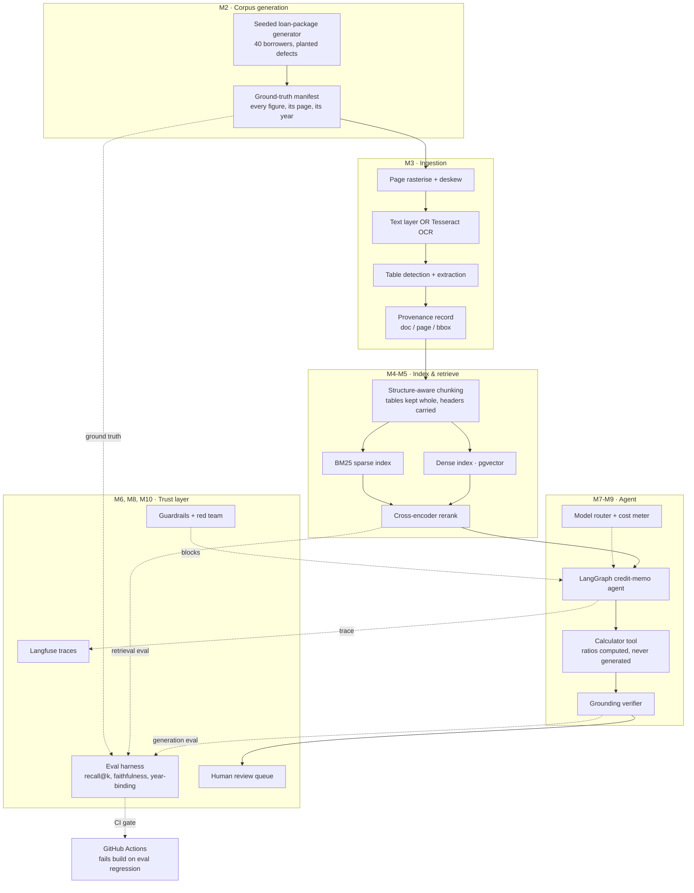
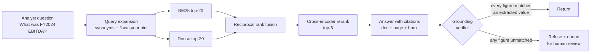

# Architecture

## System overview

## The retrieval path in detail

The refusal branch is the point of the diagram. Most RAG demos have no arrow
that returns nothing. This one does, and the eval suite specifically measures
how often it fires correctly versus spuriously.

## Why these components

| Decision | Chosen | Rejected | Reason |
|---|---|---|---|
| Vector store | pgvector in Postgres | Pinecone, Chroma, FAISS | Chunks need relational neighbours (doc, page, entity, fiscal year); a metadata-filtered hybrid query is one SQL statement. No new managed service, no bill. |
| Sparse retrieval | BM25 (rank_bm25) | Postgres full-text only | Financial queries are full of exact tokens — account labels, entity names, "EBITDA". Dense-only retrieval reliably misses them. This is the single highest-value non-obvious component. |
| Reranking | Local cross-encoder | LLM-as-reranker | 40× cheaper, ~10 ms, no API dependency in the hot path. Quality difference is measured in M6, not asserted. |
| OCR | Tesseract via pytesseract | Cloud OCR (Textract, Document AI) | Free, local, reproducible in CI. Cloud OCR is better; the ADR records that trade honestly, and the AWS billing incident from earlier this year is a live reason to keep this project off metered cloud services. |
| Agent framework | LangGraph | Bare function-calling loop, CrewAI | Explicit state graph means the control flow is inspectable and testable. An agent you cannot unit-test is a demo. |
| Tracing | Langfuse (self-hosted via Compose) | LangSmith | Runs offline, no seat cost, and it is one more container in the same Compose file. |
| Numbers | Calculator tool, always | Let the LLM compute ratios | LLM arithmetic is the loss event described in the brief. Ratios are computed in Python from extracted values, full stop. |

## Milestones

| # | Milestone | Ships | Est. hrs |
|---|---|---|---|
| M1 | Scaffold, brief, ADRs, config, CI | This delivery | 6 |
| M2 | Seeded loan-package generator + ground-truth manifest | Corpus with planted defects | 12 |
| M3 | Ingestion: OCR, deskew, tables, page provenance | Extraction quality report | 12 |
| M4 | Structure-aware chunking with source anchors | Chunk store + anchor tests | 8 |
| M5 | Hybrid retrieval: BM25 + dense + rerank | Retriever with tuned fusion | 10 |
| M6 | Eval harness + CI regression gate | recall@k, faithfulness, baseline JSON | 12 |
| M7 | LangGraph credit-memo agent + calculator tool | End-to-end memo generation | 12 |
| M8 | Guardrails, grounding verifier, red-team suite | Injection defence report | 8 |
| M9 | Model routing, cost accounting, caching | Cost-per-memo report | 6 |
| M10 | HITL review queue, model card, runbook, README | Ship ritual | 8 |

Total ≈ 94 hours. Build order is deliberate: **the eval harness (M6) lands
before the agent (M7)**, so the agent is developed against a scoreboard rather
than against vibes. That inversion is the thing most portfolio RAG projects get
wrong, and it is the thing an interviewer will notice.
